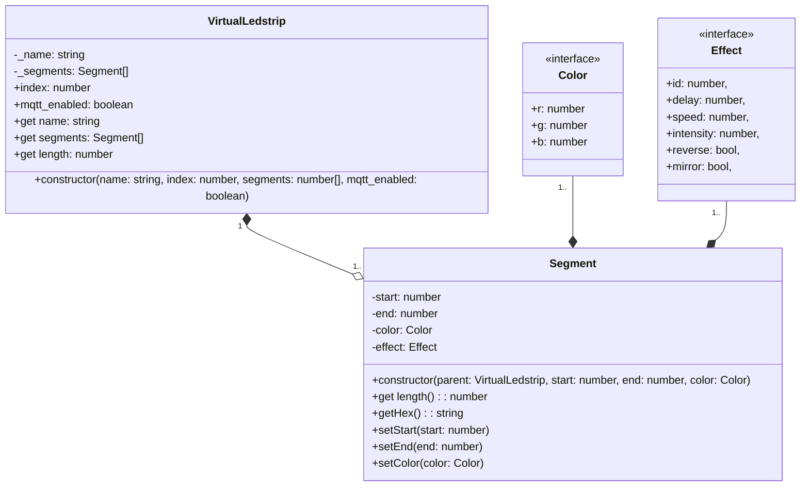

# Backend

The backend is responsible for managing the ledstrips and the MQTT communication. It is implemented in JavaScript using [Node.js](https://nodejs.org/) and the [Express framework](https://expressjs.com/).

## Setup

First clone the repository:

```bash
git clone https://github.com/vives-project-xp/InteractiveCorridor.git
```

Setup your environment variables:

```bash
cp .env-example .env
```

Fill in the environment variables in the `.env` file.

Start the backend:

```bash
docker-compose up -d
```

The backend is now served on the URL specified in the `.env` file.

## UML Diagrams



## Virtual Ledstrip

The Virtual Ledstrip is a class that represents a ledstrip. It has a name, an index, a list of segments and a flag to enable or disable the MQTT communication.

### Constructor

The constructor of the Virtual Ledstrip class receives the following parameters:

- `name`: The name of the ledstrip.
- `index`: The index of the ledstrip.
- `segments`: An array of numbers representing the segments of the ledstrip.
- `mqtt_enabled`: A boolean flag to enable or disable the MQTT communication.

### Attributes

- `_name`: The name of the ledstrip.
- `_segments`: An array of segments.
- `index`: The index of the ledstrip.
- `mqtt_enabled`: A boolean flag to enable or disable the MQTT communication.

### Properties

- `name`: The name of the ledstrip.
- `segments`: An array of segments.
- `length`: The length of the ledstrip.

### Methods

The Virtual Ledstrip class has no methods.

## Segment

The Segment class represents a segment of a ledstrip. It has a start, an end and a color.

### Constructor

The constructor of the Segment class receives the following parameters:

- `start`: The start of the segment.
- `end`: The end of the segment.
- `color`: The color of the segment.

### Attributes

- `start`: The start of the segment.
- `end`: The end of the segment.
- `color`: The color of the segment.

### Properties

- `length`: The length of the segment.

### Methods

- `getHex()`: Returns the color of the segment in hexadecimal format.
- `setStart(start)`: Sets the start of the segment.
- `setEnd(end)`: Sets the end of the segment.
- `setColor(color)`: Sets the color of the segment.
