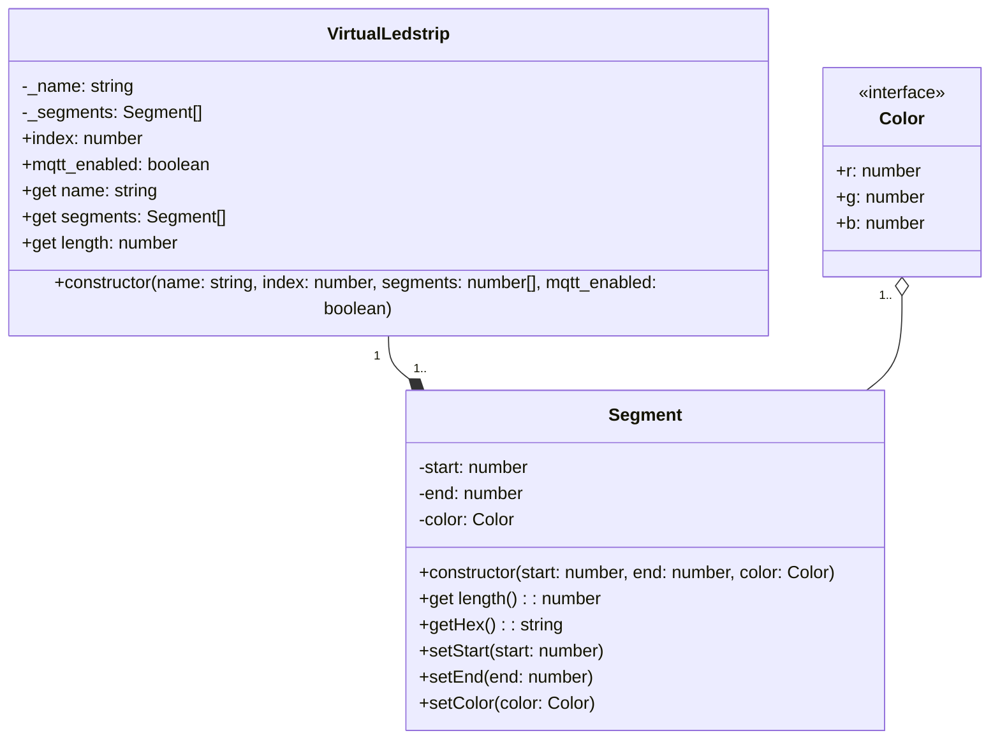

# Backend

## UML Diagrams

## Virtual Ledstrip

The Virtual Ledstrip is a class that represents a ledstrip. It has a name, an index, a list of segments and a flag to enable or disable the MQTT communication.

### Constructor

The constructor of the Virtual Ledstrip class receives the following parameters:

- `name`: The name of the ledstrip.
- `index`: The index of the ledstrip.
- `segments`: An array of numbers representing the segments of the ledstrip.
- `mqtt_enabled`: A boolean flag to enable or disable the MQTT communication.

### Attributes

- `_name`: The name of the ledstrip.
- `_segments`: An array of segments.
- `index`: The index of the ledstrip.
- `mqtt_enabled`: A boolean flag to enable or disable the MQTT communication.

### Properties

- `name`: The name of the ledstrip.
- `segments`: An array of segments.
- `length`: The length of the ledstrip.

### Methods

The Virtual Ledstrip class has no methods.
