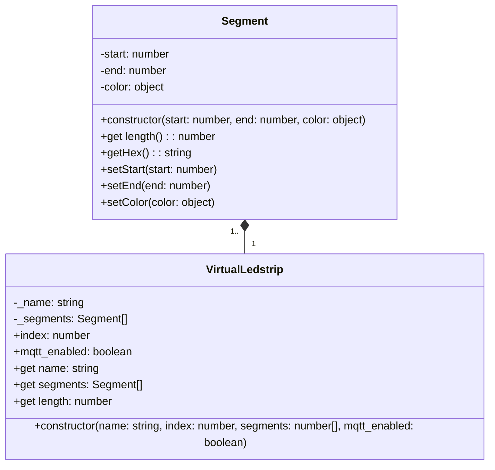

# Backend

## Virtual Ledstrip

```mermaid
classDiagram

class Segment {
    -start: number
    -end: number
    -color: object
    +constructor(start: number, end: number, color: object)
    +get length(): number
    +getHex(): string
    +setStart(start: number)
    +setEnd(end: number)
    +setColor(color: object)
}

class VirtualLedstrip{
    -_name: string
    -_segments: Segment[]
    +index: number
    +mqtt_enabled: boolean
    +get name: string
    +get segments: Segment[]
    +get length: number
    +constructor(name: string, index: number, segments: number[], mqtt_enabled: boolean)
}

Segment "1.." *-- "1" VirtualLedstrip
```
