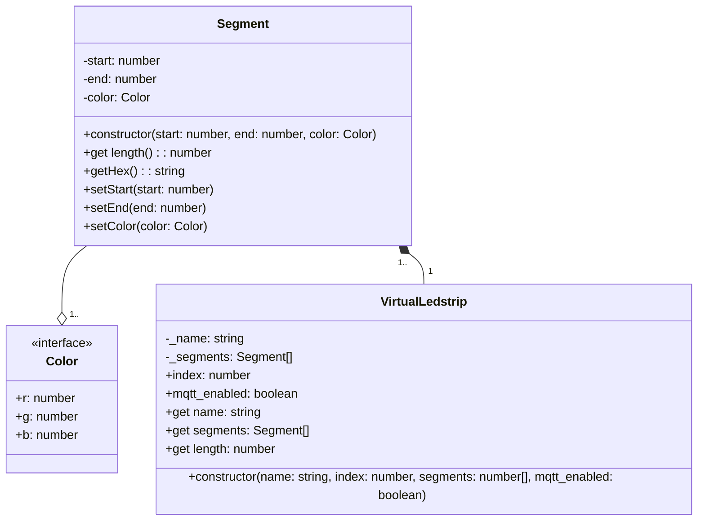

# Backend

## UML Diagrams

```mermaid
classDiagram

class Segment {
    -start: number
    -end: number
    -color: Color
    +constructor(start: number, end: number, color: Color)
    +get length(): number
    +getHex(): string
    +setStart(start: number)
    +setEnd(end: number)
    +setColor(color: Color)
}

class Color {
    <<interface>>
    +r: number
    +g: number
    +b: number
}

class VirtualLedstrip{
    -_name: string
    -_segments: Segment[]
    +index: number
    +mqtt_enabled: boolean
    +get name: string
    +get segments: Segment[]
    +get length: number
    +constructor(name: string, index: number, segments: number[], mqtt_enabled: boolean)
}

Segment --o "1.." Color
Segment "1.." *-- "1" VirtualLedstrip
```
