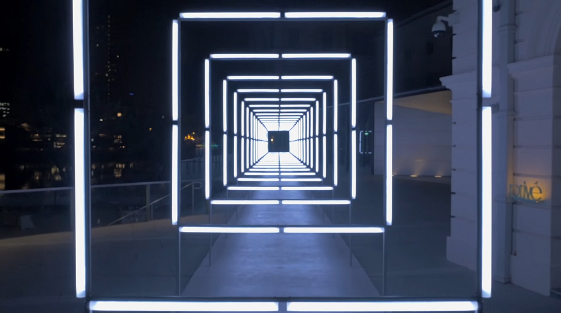

# Interactive Corridor

Welcome to the Interactive Corridor Project! This unique corridor is designed to create depth and atmosphere through innovative lighting effects. With a variety of pre-programmed light patterns and the ability to design your own, you can transform the corridor into a dynamic and immersive space.

Controlling the effects is simple, just use the web interface hosted on a central server to customize the lighting. Whether you're aiming for subtle transitions or dramatic transformations, the Interactive Corridor Project gives you the tools to set the perfect mood. Enjoy exploring the endless possibilities!

The project is based on a video of the River Nights Festival (Singapore) where there was a beautiful light setup.
https://www.youtube.com/watch?v=xEEKBbKvuMQ 

## The Team

[Robbe De Wispelaere](https://github.com/RobbeDeW) 

[Aitor Vannevel](https://github.com/imawizzard)

[Simon Stijnen](https://github.com/SimonStnn)

[Niels Denoo](https://github.com/NielsDenoo)

## The idea

- **Dynamic Light Patterns** : Create customizable lighting sequences that can change in intensity, color, and direction to generate a sense of movement and depth within the corridor.
- **User-Friendly Web Interface**: Design an intuitive web page where users can easily control and customize the corridor's lighting effects. The interface should allow for real-time adjustments, offer a library of pre-set themes, and provide options to create and save custom patterns for future use.
- **MQTT Communication**: Use MQTT (Message Queuing Telemetry Transport) to send commands from the web interface to the LED strips. This lightweight messaging protocol ensures fast and reliable communication, allowing for seamless updates to the light patterns.
- **WLED Integration**: Implement WLED, an open-source control system for LED strips, to manage the lighting effects in the corridor. WLED allows for a wide range of customization options and can be controlled remotely, making it a perfect fit for this project.

## Folder Structure

- [Website](website/README.md): All information about how the website works and how the user can interact with it.
- [Backend](Backend/README.md) All information about how the website communicates with the ledstip's.
- [Docs](docs/README.md): All information about the hardware and setup

## Corridor data flow diagram

<picture>
  <source
    srcset="docs/exports/SoftwareArchitectureDiagram_dark.svg"
    media="(prefers-color-scheme: dark)"
  />
  <source
    srcset="docs/exports/SoftwareArchitectureDiagram_light.svg"
    media="(prefers-color-scheme: light), (prefers-color-scheme: no-preference)"
  />
  
</picture>
