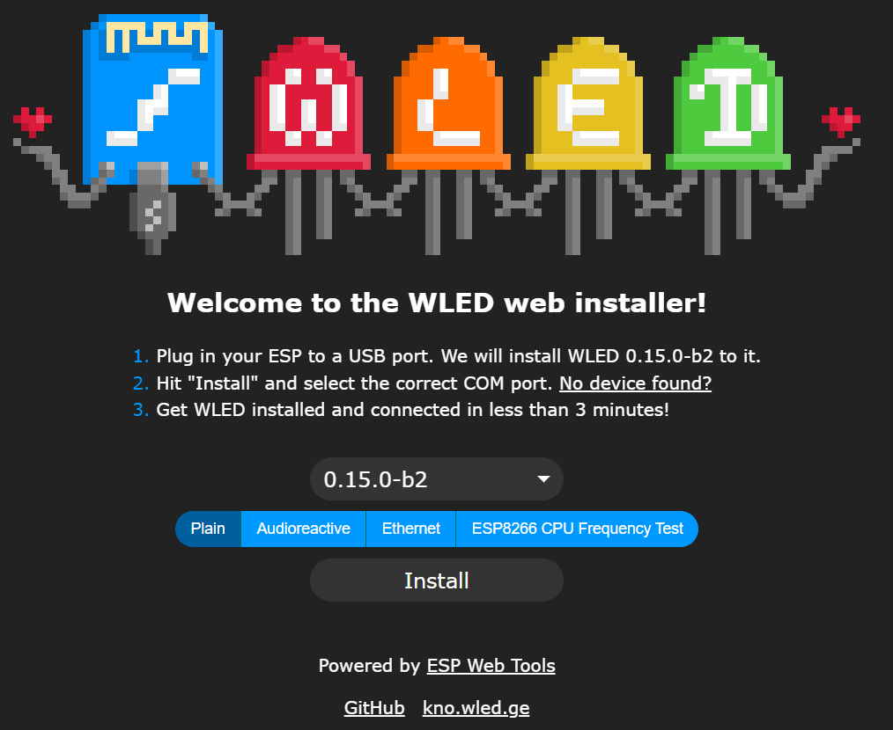
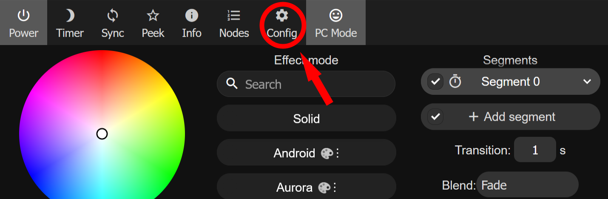
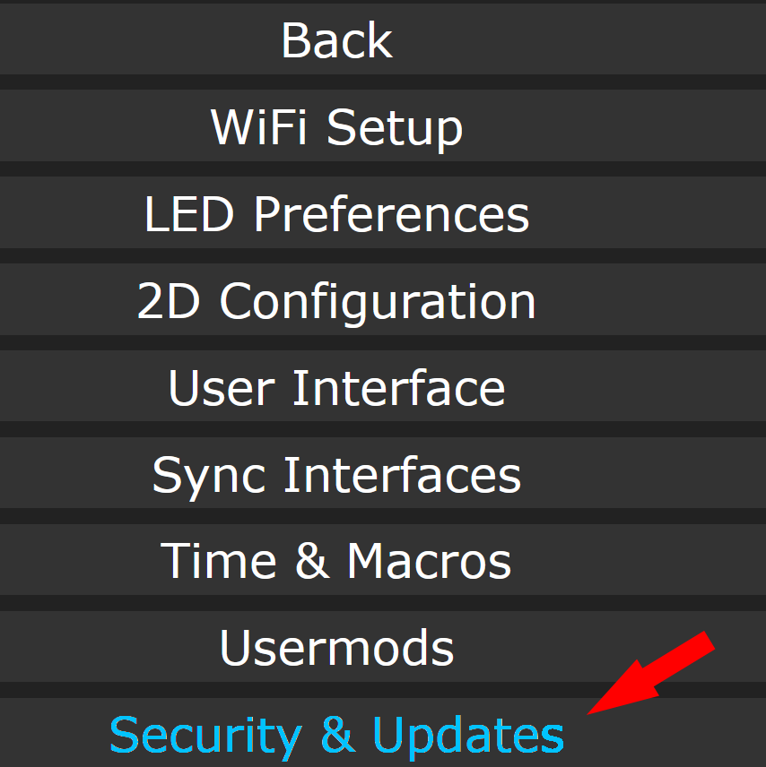
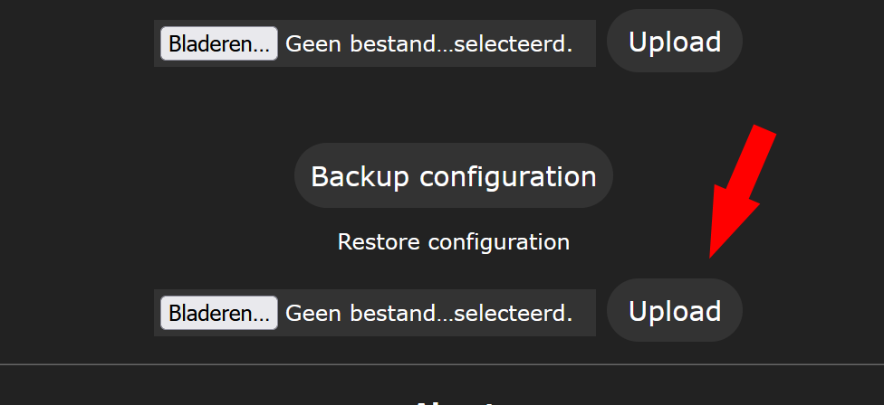
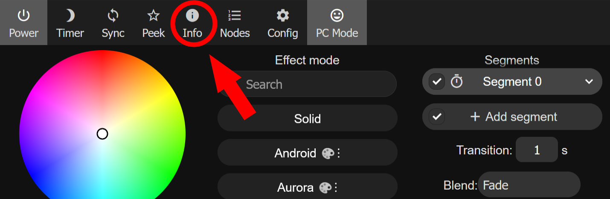
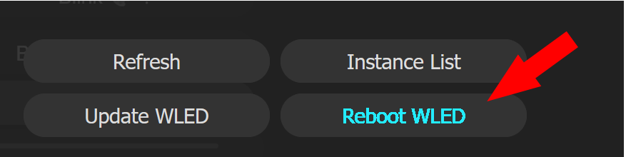
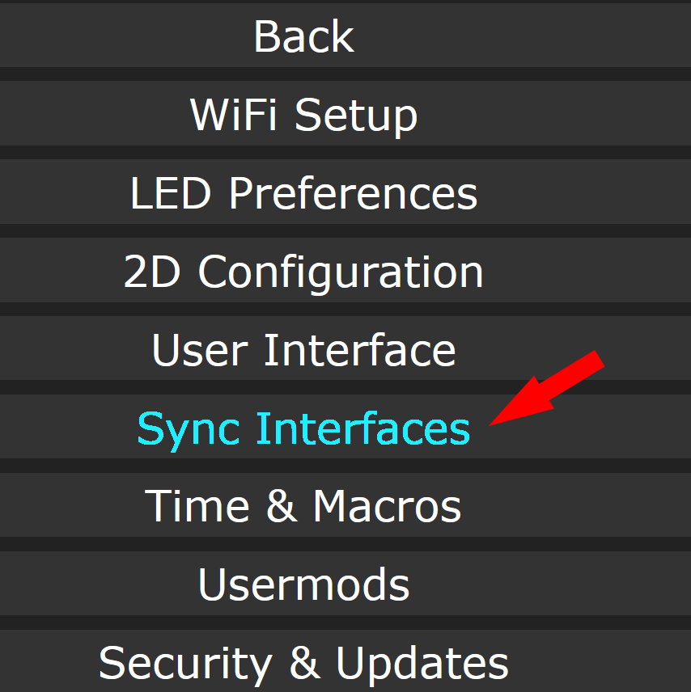
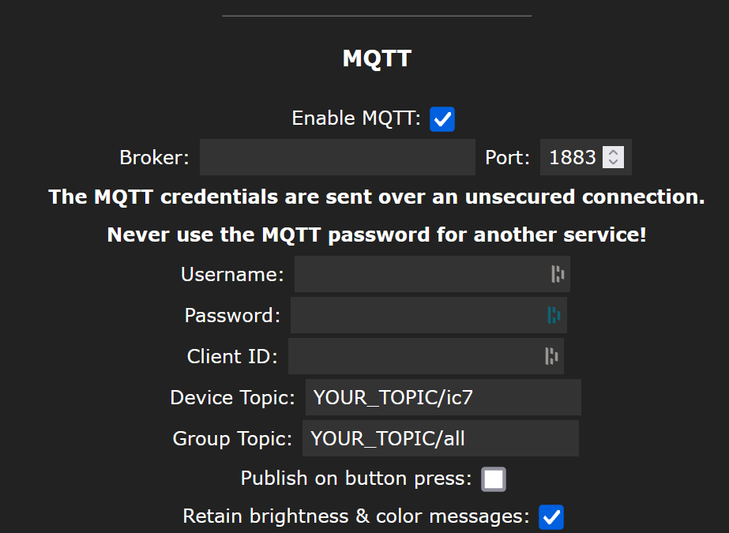

# Installing WLED on your ESP32

## Instructions

1. [Install WLED](#1-install-wled)
2. [Upload config file](#2-upload-config-file)
   - [2.1 Download the config file](#21-download-the-config-file)
   - [2.2 Upload the config file](#22-upload-the-config-file)
     - [2.2.1 Open the settings in WLED](#221-open-the-settings-in-wled)
     - [2.2.2 Open "Security & Updates"](#222-open-security--updates)
     - [2.2.3 Upload the config file](#223-upload-the-config-file)
3. [Reboot WLED](#3-reboot-wled)
4. [Setup MQTT](#4-setup-mqtt)
   - [4.1 Open the config](#41-open-the-config)
   - [4.2 Open Sync Interfaces](#42-open-sync-interfaces)
   - [4.3 Change settings](#43-change-settings)
   - [4.4 Reboot WLED](#44-reboot-wled)

## 1. Install wled

> Follow the instructions on the wled site to install wled on your device.

### **[Wled](https://install.wled.me/)**

## 2. Upload config file

### 2.1 Download the config file

You can download the config file <u>**[HERE](../wled_cfg.json)**</u>.

### 2.2 Upload the config file

> 2.2.1 Open the settings in wled.

 
 

> 2.2.2 Open "Security & Updates".

 
 

> 2.2.3 Upload the config file.

_Don't forget the save after upload!_

## 3. Reboot wled

 

## 4. Setup mqtt

### 4.1 Open the config

### 4.2 Open Sync Interfaces

### 4.3 Change settings

> Fill in your broker url and login.
> Device & group topic is the topic you entered in the env file

#### **AFTER YOUR TOPIC, YOU NEED TO ADD /ic[LED_NUMBER]**

#### **THE GROUP TOPIC SHOULD END WITH /ALL**

_Don't forget the save after changing the settings!_

### 4.4 Reboot wled

Reboot wled one more time to load all the settings (see [3.Reboot wled](#3-reboot-wled)).
