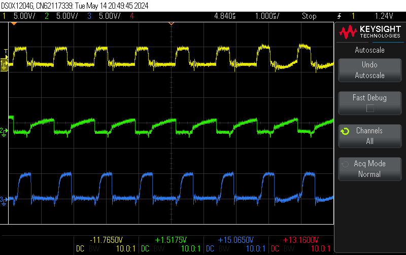

# Documentation

Welcome to the documentation page! This is your go-to resource for understanding everything about our hardware system, including a detailed breakdown of the components we use. Whether you're building your own setup or simply exploring the technology, this page aims to provide all the information you need.

## Table of contents

- [Documentation](#documentation)
  - [Table of contents](#table-of-contents)
  - [Installation](#installation)
  - [Bill of Materials](#bill-of-materials)
  - [Level shifter](#level-shifter)
  - [Architecture documents](#architecture-documents)
    - [Hardware architecture diagram](#hardware-architecture-diagram)
    - [Wiring architecture diagram](#wiring-architecture-diagram)
    - [Wiring for Level shifter](#wiring-for-level-shifter)
  - [ESP Pinout](#esp-pinout)
  - [Measurements](#measurements)

## Installation

The installation of the hardware is quite simple. You can follow the steps below to install the hardware system:

1. **Mount the ledstrips**: Mount the ledstrips on the pillars. Mounting can be found in [mounting](./mounting/).
2. **Setup the ESP**: Setup the ESP32-C3. Installation steps can be found [here](./ESP_SETUP.md).
3. **Run the backend**: Run the backend. Installation steps can be found [here](../Backend/README.md#installation).

## Bill of Materials

These are the components that we purchased. You of course have different websites to purchase this, but we mainly looked at the price and quality of the product.

The Bill of Materials (BOM) lists all the components, parts, and materials needed for one corridor consisting of 6 pillars:

| Component                                                                                                                                                                                                                                                                                  | Quantity | Price / unit |
| :----------------------------------------------------------------------------------------------------------------------------------------------------------------------------------------------------------------------------------------------------------------------------------------- | :------: | -----------: |
| [**ws2814-rgbw-led-strip**](https://www.btf-lighting.com/products/ws2814-12v-24v-4-in-1-similar-sk6812-rgbw-pixels-addressable-ws2811-rgbww-rgbcw-5050-3pin-led-lights?variant=43463309459682)                                                                                             |    6     |       €22,35 |
| [**esp32-c3**](https://www.digikey.be/en/products/detail/espressif-systems/ESP32-C3-DEVKITM-1/13684315?s=N4IgTCBcDaIIwE4BsBWAtAUQMoAUDMYaAwnmgCIYBqA0gJIAqAsmnGgHJkgC6AvkA)                                                                                                                |    6     |      €8,8451 |
| [**ledstrip-profile**](https://www.ledshop-groenovatie.com/Aluminium-Profiel-LED-Strip-Opbouw-1,5m-Compleet-1)                                                                                                                                                                             |    16    |       €17,95 |
| [**dcdc-converter**](https://www.otronic.nl/nl/lm2596s-instelbare-step-down-4-40v-125-37v-met-onb.html)                                                                                                                                                                                    |    6     |        €5,39 |
| [**prototype-printplate**](https://www.otronic.nl/nl/experimenteer-prototyping-printplaat-7x9cm-groen.html)                                                                                                                                                                                |    6     |        €1,25 |
| [**cable-box**](https://www.allekabels.be/lasdoos/22371/3914218/aansluitdoos.html?mc=nl-be&gad_source=4&gclid=CjwKCAiAivGuBhBEEiwAWiFmYfwxxcCCo7jKSgO8jgDI1kcRSnMjFWVOvQXYugo6C8fBlBvdbIoQIxoCPRkQAvD_BwE)                                                                                 |    6     |        €1,59 |
| [**power-supply**](https://www.ledstripkoning.be/accessoires/adapters-12-en-24-volt/600w-24v-25a-professionele-voeding-voor-led-strips?gad_source=1&gclid=CjwKCAiAivGuBhBEEiwAWiFmYTggibyc4zfjcq7FT6RLFWak3v8JL1AJRPUxQzaCdWfI0lQoOlbzJBoCOJAQAvD_BwE)                                     |    1     |       €76,95 |
| [**block-terminal**](https://be.farnell.com/camdenboss/ctb0100-6/pcb-terminal-5mm-6p/dp/3378876)                                                                                                                                                                                           |    6     |        €2,12 |
| [**fuse-holder**](https://www.allekabels.be/zekeringen/1615/5715/standaard-zekeringhouder.html?lang=nl-be)                                                                                                                                                                                 |    3     |        €4,22 |
| [**autofuse-set-10a**](https://www.allekabels.be/zekeringen/1615/1067905/mini-autozekering-10-ampere.html)                                                                                                                                                                                 |    1     |        €5,29 |
| [**cables**](https://netstore.rexel.be/NS/servlet/be.rex.ns.cf.RexStartServlet?sessionreset=1)                                                                                                                                                                                             |    1     |       €36,30 |
| [**female-pin-header-set**](https://be.farnell.com/en-BE/harwin/m20-7822046/connector-receptacle-tht-2-54mm/dp/7991967?gad_source=1&gclid=CjwKCAiA_5WvBhBAEiwAZtCU72bh7TvcaRVvL1va6MB8IyMt07SbZYtpANeCO3Gfjd5bcRMUCOIMTRoCZ2kQAvD_BwE&CMP=KNC-GBE-SHOPPING-PMAX-Test1607&gross_price=true) |    10    |        €19,8 |
| [**Male-pin-header-set**](https://be.farnell.com/harwin/m20-9990846/connector-header-tht-2-54mm-8way/dp/1022257)                                                                                                                                                                           |    10    |        €3,52 |
| [**Lusterklemmen**](https://www.hubo.be/nl/p/profile-lusterklem-6mm-pvc-4-stuks/98445/)                                                                                                                                                                                                    |    1     |        €4,59 |

## Level shifter

| Component                                                                                                                  | Quantity | Price / unit |
| :------------------------------------------------------------------------------------------------------------------------- | :------: | -----------: |
| [**Resistor1K**](https://www.otronic.nl/nl/10x-weerstand-1k-ohm-1-4-watt-5.html)                                           |    5     |        €0,49 |
| [**Resistor1,5K**](https://www.kiwi-electronics.com/nl/weerstand-1-5k-ohm-1-4-watt-5-10-stuks-657)                         |    2     |        €1,00 |
| [**transistor**](https://be.farnell.com/on-semiconductor/bc547ctfr/transistor-bipol-npn-45v-to-92/dp/2453792?st=BC547CTFR) |    24    |       €6,312 |
| [**capacity1nF**](https://gigatek.be/nl/velleman-keramische-condensator-1nf--velvec1n0)                                    |    24    |        €0,08 |

## Architecture documents

### Hardware architecture diagram

<picture>
  <source
    srcset="./exports/HardwareArchitectureDiagram_dark.svg"
    media="(prefers-color-scheme: dark)"
  />
  <source
    srcset="./exports/HardwareArchitectureDiagram_light.svg"
    media="(prefers-color-scheme: light), (prefers-color-scheme: no-preference)"
  />
  
</picture>

The [architecture diagram](./ArchitectureDiagram.drawio) can be visualized in [app.diagrams.net](https://app.diagrams.net/) or with the [Draw.io Integration](https://marketplace.visualstudio.com/items?itemName=hediet.vscode-drawio) vscode extension.

If we look at the datasheets of all components, we need 2 different voltages.

- 24V for the ledstip
- 5V for the data and esp

### Wiring architecture diagram

<picture>
  <source
    srcset="./exports/Wiring-Wiring.drawio_Dark.svg"
    media="(prefers-color-scheme: dark)"
  />
  <source
    srcset="./exports/Wiring-Wiring.drawio_Light.svg"
    media="(prefers-color-scheme: light), (prefers-color-scheme: no-preference)"
  />
  
</picture>

### Wiring for Level shifter

<picture>
  <source
    srcset="./exports/Wiring-Level-Shifter.drawio_Dark.svg"
    media="(prefers-color-scheme: dark)"
  />
  <source
    srcset="./exports/Wiring-Level-Shifter.drawio_Light.svg"
    media="(prefers-color-scheme: light), (prefers-color-scheme: no-preference)"
  />
  
</picture>

The [architecture diagram](./ArchitectureDiagram.drawio) can be visualized in [app.diagrams.net](https://app.diagrams.net/) or with the [Draw.io Integration](https://marketplace.visualstudio.com/items?itemName=hediet.vscode-drawio) vscode extension.

## ESP Pinout

|  Pin  | Description |
| :---: | ----------- |
| GPIO1 | Ledstrip 1  |
| GPIO3 | LedFstrip 2 |

## Measurements

We have scope images of the level shifter, illustrating how the ESP (depicted in yellow) sends a 3.3V data signal. As it traverses the level shifter (represented by the blue signal), it is boosted to 5V. The green signal, measured at the collector of the first transistor, demonstrates signal inversion, necessitating the use of a second transistor.

