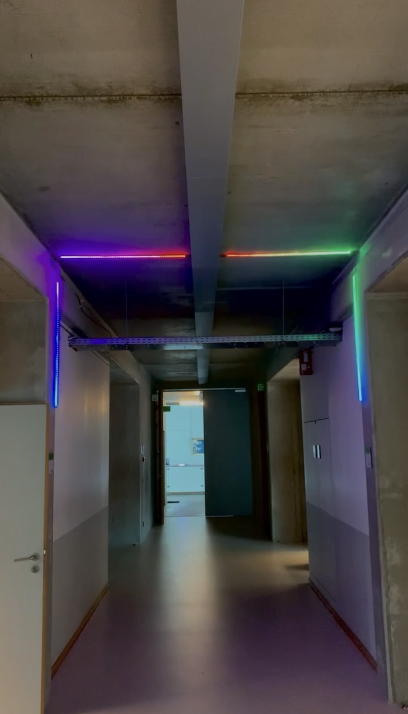

# SETUP

> Ensure a well-organized setup where the LED strips are securely fastened and everything is neatly concealed.

### Discussion with Technical Service (21/02/24)

The technical service is considering providing power in the cable tray that crosses corridor B. We will provide an adapter that converts 220V to 24V. This will be installed in room B303, in the ceiling near the projector. The technical service will install a cable tray at the top of the corridor up to the first concrete pillar. We will supply aluminum brackets for the LED strip, which the technical service will then attach (drilling/adhesion).

We will handle the finishing touches:

- Box for the ESPs
- Brackets for the LED strips
- Wiring concealment

### First Corridor (22/04/2024)
To reduce costs, we have shortened the length of the defusers on the wall and they are now all 1m.

