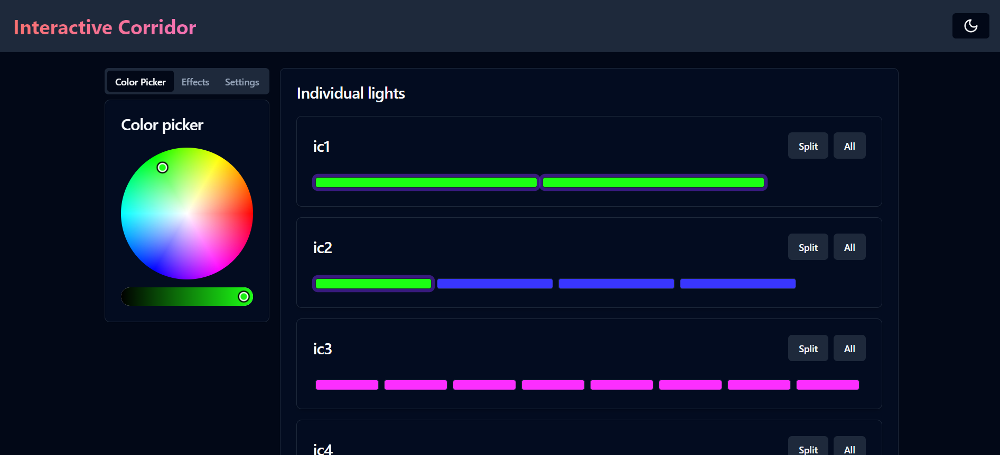
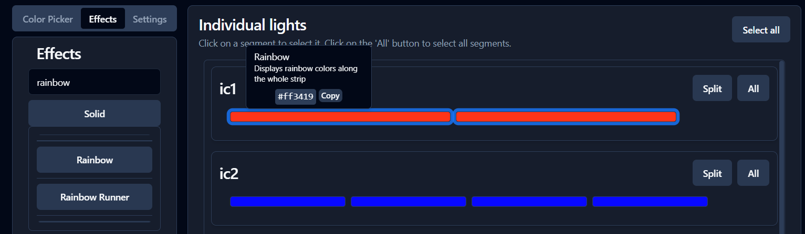
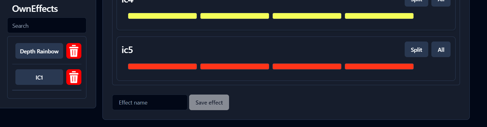
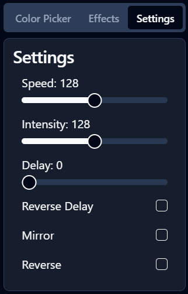
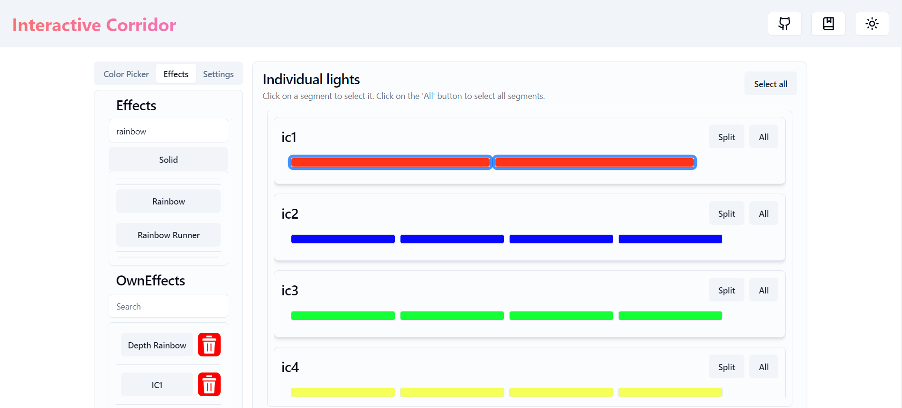

# Welcome to the "Website" page.

This website is utilized to manage all corridors, thereby creating stunning effects in the hallway.

## Technologies used

- [Axios-HTTP](https://axios-http.com/): a promise based HTTP client for the browser and node.js
- [Tailwind CSS](https://tailwindcss.com/): a utility-first CSS framework
- [Shadcn-vue](https://www.shadcn-vue.com/): a component library for vue
- [Vue.js](https://vuejs.org/): a JavaScript framework for building user interfaces
- [Docker](https://www.docker.com/): a platform for building, shipping, and running applications in containers

## Home page

The main page serves as the central hub for customizing the aesthetic appeal of your corridors. It offers a user-friendly interface to effortlessly alter the colors of different segments according to your preferences. Each segment can be individually tailored with just a click. Simply choose the segment you wish to modify, and watch it transform before your eyes as you select your preferred color scheme.

But customization doesn't stop there. Want to create a more dynamic layout? With the "split" button, you can easily divide the corridor into smaller sections, providing greater flexibility in design. Whether you prefer a uniform look or a segmented display, this feature empowers you to configure your space exactly as you envision it.

To streamline the customization process even further, the "all" option enables you to select the entire corridor at once. This eliminates the need to manually click on each segment, saving you time and effort. Whether you're fine-tuning the details or making sweeping changes, the main page offers intuitive tools to bring your corridor design to life with precision and ease

## Effect page

### WLED effects

The effect page serves as a hub for enhancing the ambiance of your corridor with captivating visual effects. Similar to the color customization process, adjusting effects is seamless and intuitive. Simply select the segment or segments you wish to modify, and then choose from a diverse array of effects. From subtle pulsations to vibrant rainbows and beyond, there's a wide selection to suit every mood and theme.

What's exciting about these effects is their dynamic nature. Unlike color changes, the effects won't immediately manifest on your website interface. Instead, you'll need to hover over the segment to see what te effect is on that segment.

### Own effects

Unlock your creativity by crafting and saving your own unique effects to imbue your corridors with a personalized touch. Whether it's experimenting with vibrant colors or layering mesmerizing effects, the possibilities are endless. Once you've perfected your creation, simply assign it a distinct name and save it for future use.

Choosing a descriptive and exclusive name for your custom effect is essential, as duplicate names are not permitted. This ensures that each effect in your repertoire is easily identifiable and avoids confusion when managing your collection. By meticulously naming your effects, you pave the way for seamless organization and effortless access to your favorite creations.

The ability to save custom effects streamlines your workflow, allowing you to effortlessly apply and replay intricate designs without starting from scratch each time. Whether you're refining existing effects or inventing entirely new ones, this feature empowers you to curate a library of personalized enhancements tailored to your unique vision.

## Settings page

## Some extra's

As an added bonus, we've incorporated a delightful feature that allows you to effortlessly switch between light and dark themes for your website. Simply look to the top right corner of your screen, where you'll find an inviting sun and moon icon. By clicking on these icons, you can seamlessly transition between the two themes, catering to your preferred browsing experience.

Of course we have set dark theme as default 😉

but here is an example of the white theme:

